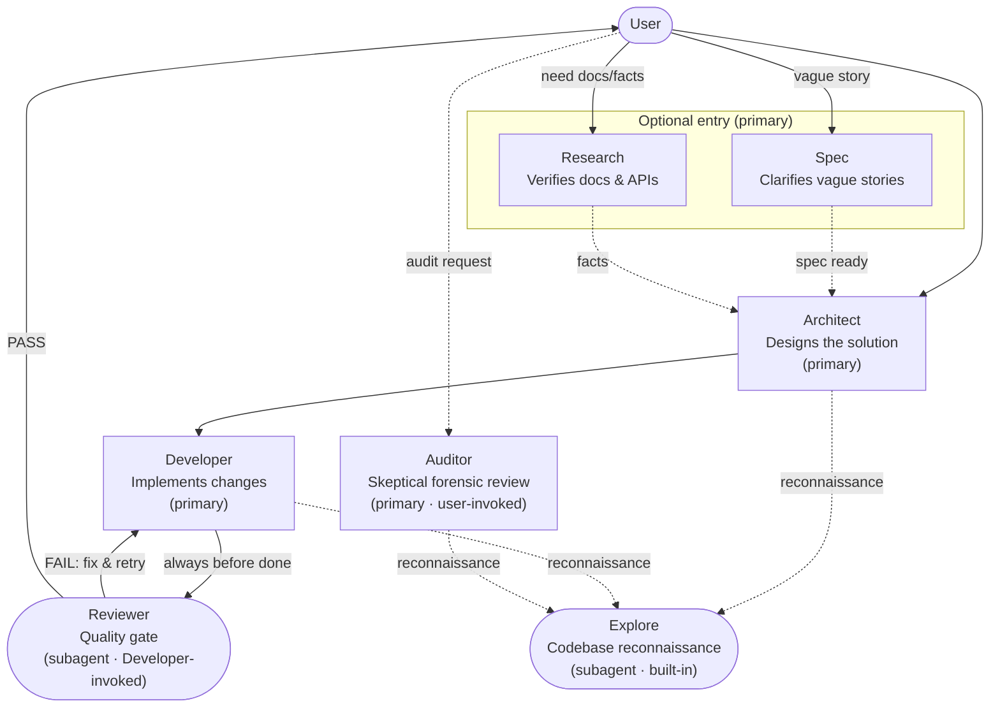

# OpenCode Path

A structured multi-agent workflow CLI for [opencode](https://opencode.ai) that installs specialized agents, configures models, and applies stack-specific permission profiles. Separate concerns, minimize blast radius, and optimize model usage by role.

## Overview

The workflow follows a structured pipeline from requirements to reviewed implementation, with optional entry points and a user-invoked audit layer:



**Legend:** Solid arrows = primary flow · Dashed arrows = optional/support paths · `(subagent)` = invoked by another agent, not directly by user.

This workflow defines 6 specialized agents with clear responsibilities:

| Agent | Role | Mode | Permissions |
|-------|------|------|-------------|
| **Spec** | Clarifies vague stories into testable specs before design | Primary | Read-only, no bash |
| **Architect** | Designs system architecture, produces structured design decisions | Primary | Work-folder artifact writes + `mkdir -p .path/work/*` |
| **Developer** | Implements code changes end-to-end | Primary | Broad application `edit: allow` + risk-based bash policy |
| **Auditor** | Audits existing work for failures, risks, and gaps | Primary | Read-only + narrow proactive append-only audit notes for explicit work folders |
| **Research** | Researches documentation, APIs, SDK behavior, and best practices | Primary | Read-only, no bash |
| **Reviewer** | Reviews code changes, returns PASS/FAIL verdict | Subagent | Read-only + inspection commands + confirmation for project-specific validation |
| **Explore** | Fast codebase exploration | Subagent (built-in) | Read-only |

### Key Design Principles

1. **Blast Radius Minimization**: Only Developer modifies application code broadly. Architect can create/write handoff artifacts, Reviewer is strictly read-only, and Auditor may only append narrow audit notes when auditing an explicit or clearly detectable work folder.
2. **Separation of Concerns**: Clarify (Spec) → Research (Research) → Design (Architect) → Implement (Developer) → Review (Reviewer) → Audit (Auditor).
3. **Cross-Session Planning**: Architect produces self-contained cross-session artifacts under `.path/work/{feature-slug}/`.
4. **Granular Permissions**: Risk-based bash policy for Developer; Reviewer is strictly read-only; Auditor is read-only for code with a narrow work-folder audit-note exception; Architect can only create work-folder directories under `.path/work/`.
5. **Model-Agnostic by Default**: No models are hardcoded. Use `opencode-path models` to configure models explicitly for each agent.
6. **Stack Profiles via Opt-In Command**: The CLI installs agnostic agent templates by default. Stack-specific permission profiles (test runners, linters, type checkers) are added separately via `opencode-path profiles`, keeping the base install clean and technology-agnostic.

## Quick start

```bash
# Install globally
npm install -g opencode-path

# Initialize into your project (guided setup)
opencode-path init

# Or initialize into global config
opencode-path init --global
```

`init` walks you through scope selection, agent installation, stack profiles, and model configuration in one guided flow. Restart opencode after any change.

## Commands

### `init`

Initialize the workflow pack with a guided setup: scope → agents → profiles → models → consolidated summary → confirm.

```
opencode-path init [options]
```

**Options:**

| Flag | Description |
|------|-------------|
| `--global` | Use global scope (`~/.config/opencode/`) |
| `--project` | Use project scope (`.opencode/`) |
| `--dry-run` | Run the full selection flow, show the planned summary, and exit without writing |
| `-y, --yes` | Skip the final confirmation prompt (selections are still interactive) |

**Behavior:**

1. Validates all template frontmatter. If any template is malformed, prints the file(s) and exits `1` without prompting.
2. Resolves scope (project or global). If `--global` or `--project` is passed, uses that scope. Otherwise prompts interactively.
3. Scans current agent state and displays conflict warnings (files without the managed marker).
4. **Agents step** — checkbox multi-select over all managed agents. Active agents are pre-selected. Exposes a visible "Skip for now" option and a "← Cancel" option.
5. **Profiles step** — checkbox multi-select over available stack profiles plus "All stacks". Only shown if patchable agents (`developer`, `reviewer`, `auditor`) will be active. Exposes "Skip for now" and "← Cancel".
6. **Models step** — iterates active agents, prompting once per agent with model options from `opencode models` (if available) plus "Custom model..." and "Skip for now". Shown with a spinner while loading models. Choosing "Custom model..." opens a free-text input; cancel it with Ctrl+C.
7. Displays a consolidated summary of all planned changes (agents, profiles, models).
8. If no changes are planned, prints `No changes needed.` and exits `0`.
9. Asks for final confirmation (skipped by `--yes` or `--dry-run`).
10. Applies all changes and prints results.

**Re-running `init`** is idempotent. Already-active agents are shown as selected and cannot be deselected. If nothing needs to change, it prints `No changes needed.` and exits `0`.

**`--dry-run`** runs the entire selection flow, shows the consolidated summary, and exits `0` without writing any files.

**Optional Graphify integration:** `init` will offer to install [Graphify](https://github.com/ggcaponetto/graphify) as an optional aid for repository exploration. It defaults to no and is not installed unless you accept the prompt. Pass `--with-graphify` to accept without the prompt. `--yes` alone does **not** accept Graphify. The integration installs the official Graphify CLI (via `uv tool install graphifyy`), the official OpenCode skill, and a managed `graphify-explorer` skill for the Explorer agent. Failure of any Graphify step does **not** abort the overall `opencode-path` installation. Graphify hooks and automatic graph refresh are intentionally **not** installed.

---

### `graphify`

Initialize or incrementally update the local Graphify repository graph.

```
opencode-path graphify [options]
```

**Options:**

| Flag | Description |
|------|-------------|
| `--force` | Force-update an existing graph (maps to `graphify update . --force`) |

**Behavior:**

1. Verifies the Graphify CLI is available. If not, prints an actionable error directing you to run `opencode-path init --with-graphify` or install Graphify manually.
2. If `graphify-out/graph.json` does not exist, runs `graphify .` to initialize a new graph.
3. If `graphify-out/graph.json` exists, runs `graphify update .` for an incremental update.
4. With `--force` and an existing graph, runs `graphify update . --force`. With `--force` and no graph, initializes normally.
5. After a successful init or update, attempts to write `.path/graphify-state.json` with freshness metadata: schema version, timestamp, Graphify version, compatible install range, Git commit, and working tree dirty status. If the state file cannot be written (e.g. filesystem error), a warning is printed but the graph refresh is still considered successful.
6. Does **not** install hooks, create branches, create worktrees, or modify `.path/work`.

**Graphify freshness state (`.path/graphify-state.json`):**

After a successful `opencode-path graphify` run, a `.path/graphify-state.json` file is written as advisory metadata. The state file is valid JSON with the following fields:

| Field | Description |
|-------|-------------|
| `schemaVersion` | Schema version (`1`) |
| `updatedAt` | ISO 8601 timestamp of the refresh |
| `graphifyVersion` | Parsed semantic version string (e.g. `"0.9.11"`) or `null` |
| `graphifyVersionRaw` | Raw `graphify --version` output or `null` |
| `graphifyCompatibleRange` | Compatible install range (currently `>=0.9.0,<0.10.0`) |
| `commit` | `HEAD` commit hash at refresh time, or `null` when Git is unavailable |
| `workingTreeDirty` | `true`/`false` when Git status is available, or `null` when unavailable |

The state file is advisory — it helps Explorer judge graph freshness without automatically rebuilding the graph. It is written to `.path/graphify-state.json` relative to the repo root. Whether to track this file in Git (or ignore it) is left to your repo's policy.

**Graphify installation and compatible version range:**

- New Graphify CLI installs (via `init --with-graphify`) use `uv tool install graphifyy>=0.9.0,<0.10.0` — the compatible `0.9.x` release line.
- Existing Graphify CLI installations are **not** automatically reinstalled, downgraded, or upgraded. If you already have Graphify installed through any method (`uv tool install`, `pip`, etc.), it will be used as-is.
- Graphify is and remains **optional**. No agent workflow requires it.

**Default behavior:**

- Graphify hooks, background/watch refresh, and automatic graph rebuilds on Explorer use are **not** installed or enabled by default.
- Explorer may use `.path/graphify-state.json` metadata as a freshness hint during medium/large reconnaissance, but it will not auto-refresh the graph.
- When closing a feature, Developer may suggest running `opencode-path graphify` before commits if `.path/graphify-state.json` exists — skipping the refresh is always valid.

---

### `agents`

Manage which workflow agents are active: install, delete, hide, or restore.

```
opencode-path agents [options]
```

**Options:**

| Flag | Description |
|------|-------------|
| `--global` | Use global scope |
| `--project` | Use project scope |
| `--dry-run` | Show planned changes without applying |
| `-y, --yes` | Skip the confirmation prompt |

**Behavior:**

1. Resolves scope and displays agent directory and config paths.
2. Shows a checkbox multi-select of all managed agents (custom + built-ins) with status glyphs: `●` active, `○` missing, `◌` hidden, `✕` conflict.
3. Checked agents will be active. Unchecked custom agents are deleted. Unchecked built-ins are hidden via config.
4. Conflict agents (manual files without the managed marker) are displayed but not modifiable.
5. Shows planned changes. In `--dry-run` mode, exits without writing.
6. Asks for confirmation (skipped by `--yes`), then applies changes.

| Operation | Custom agent | Built-in agent (plan, build, explore) |
|-----------|-------------|--------------------------------------|
| Activate | Install `.md` file from template | Remove `disable: true` from config |
| Deactivate | Delete `.md` file | Set `disable: true` in config |

---

### `models`

Configure model IDs for active managed agents.

```
opencode-path models [options]
```

**Options:**

| Flag | Description |
|------|-------------|
| `--global` | Use global scope |
| `--project` | Use project scope |

**Behavior:**

1. Resolves scope. Shows a spinner while loading models from `opencode models`.
2. Shows a select menu to choose an agent or "Set all active agents to the same model".
3. For each agent, shows available models (from OpenCode) plus "Custom model...".
4. Custom agents store models in frontmatter. Built-in agents store models in `opencode.json`.
5. After configuring, asks whether to configure another agent.

| Agent | Model stored in |
|-------|----------------|
| spec, architect, developer, auditor, reviewer, research | Agent `.md` file frontmatter `model:` field |
| plan, build, explore | `opencode.json` `agent.<name>.model` field |

Model IDs should use `provider/model-id` format (e.g., `anthropic/claude-sonnet-4-6`).

---

### `profiles`

Apply stack-specific permission profiles to installed agents.

```
opencode-path profiles [options]
```

**Options:**

| Flag | Description |
|------|-------------|
| `--global` | Use global scope |
| `--project` | Use project scope |
| `--dry-run` | Show planned changes without applying |
| `-y, --yes` | Skip the confirmation prompt |

**Behavior:**

1. Resolves scope. Checks for active patchable agents (`developer`, `reviewer`, `auditor`).
2. If no patchable agents are active, shows a warning and exits.
3. Shows a checkbox multi-select of available profiles plus "All stacks".
4. Profiles are inserted at the profile marker line in agent files using idempotency markers.
5. In `--dry-run` mode, exits without writing.

**Available profiles:**

| Profile | Validation commands |
|---------|-------------------|
| JavaScript / TypeScript | npm test, pnpm lint, npx jest, npx vitest, npx eslint, npx prettier --check, etc. |
| Python | pytest, ruff check, mypy, pyright |
| Go | go test, go vet (+ go fmt as "ask" for Developer) |
| Rust | cargo test, cargo check, cargo clippy, cargo fmt --check (+ cargo fmt as "ask" for Developer) |
| Swift | swift test, swift format lint (+ swift build, swift format as "ask" for Developer) |
| Java / Kotlin | ./gradlew test, ./gradlew check, gradle test, mvn test |
| Ruby | bundle exec rspec, bundle exec rubocop |
| PHP | composer test, vendor/bin/phpunit, vendor/bin/phpstan |

**Role-specific behavior:** Developer receives the full profile including controlled mutating commands (listed as "ask"). Auditor and Reviewer receive only the read-only validation subset.

---

### `uninstall`

Remove managed custom agent files. All config entries are preserved.

```
opencode-path uninstall [options]
```

**Options:**

| Flag | Description |
|------|-------------|
| `--global` | Use global scope |
| `--project` | Use project scope |
| `-y, --yes` | Skip the confirmation prompt |

**Behavior:**

1. Resolves scope and scans the agent directory.
2. Identifies managed custom agent files (containing the managed marker) for deletion.
3. Identifies unmarked files — these are **skipped** and never deleted.
4. Shows the planned removals and asks for confirmation (skipped by `--yes`).
5. Removes managed files and preserves `opencode.json`, all config entries, and all unmarked files.

**What is removed:**
- Custom agent `.md` files that contain `<!-- managed-by: opencode-path -->`

**What is preserved:**
- `opencode.json` itself (never deleted)
- Unmarked custom agent files
- All built-in agent config entries (`agent.<name>.disable`, `agent.<name>.model`, etc.) — these are preserved because the CLI cannot distinguish user-set entries from opencode-path-set entries
- Any non-managed config fields

> **Note:** If opencode-path previously hid a built-in agent (by setting `agent.<name>.disable: true`), uninstall will **not** restore it. Run `opencode-path agents` to restore hidden built-in agents before uninstalling if desired.

---

## Concepts

### Managed agents

The workflow pack manages a catalog of agents:

| Agent | Kind | Role |
|-------|------|------|
| spec | custom | Requirements clarification |
| architect | custom | System design |
| developer | custom | Implementation |
| reviewer | custom | Code review (subagent) |
| auditor | custom | Audit and verification |
| research | custom | Documentation research |
| plan | built-in | Planning (native to opencode) |
| build | built-in | Build orchestration (native to opencode) |
| explore | built-in | Codebase exploration (native to opencode) |

**Custom agents** are installed as `.md` files in the agent directory with a hidden marker (`<!-- managed-by: opencode-path -->`). The marker lets the CLI distinguish workflow-managed files from manual files.

**Built-in agents** (plan, build, explore) are native to opencode. They are active by default. opencode-path manages their visibility (hide/restore) and model configuration via `opencode.json`.

### Scopes

Commands accept `--global` or `--project` to select the installation target:

- **Project** (`.opencode/`): per-project agents and config
- **Global** (`~/.config/opencode/`): shared across all projects

If neither flag is passed and the terminal is interactive, a scope selection prompt appears. If both flags are passed, the command exits with a usage error. In non-interactive mode, one of the flags is required.

### Conflict detection

If a file exists at a managed agent path without the managed marker, it is a **conflict**. Conflicts are displayed but never overwritten, deleted, or modified. To resolve:

1. If the file was installed by a previous version of opencode-path: add the managed marker to the end of the file.
2. If it is your own custom agent: leave it as-is.
3. If you want to replace it: delete the file manually and re-run `init` or `agents`.

### Stack profiles

Profiles add stack-specific test runners, linters, and type checkers to agent permission blocks. They are applied at a designated marker line in agent files using idempotency markers (`BEGIN`/`END` blocks), so re-running the command does not duplicate entries.

Profiles have two variants per stack:
- **Developer**: full profile including controlled mutating commands (formatters, builds) listed as `ask`
- **Auditor/Reviewer**: read-only validation subset only

### Exit codes

| Code | Meaning |
|------|---------|
| `0` | Success or no-op |
| `1` | Generic error |
| `2` | Usage error (e.g., `--global --project` together, or missing scope in non-interactive mode) |
| `130` | Canceled (Ctrl+C or ← Cancel) |

### Cancellation

Select and checkbox prompts expose a visible "← Cancel" option. Confirmation prompts and free-text input prompts are canceled with Ctrl+C. `init` is the exception: its final confirmation and the custom-model format confirmation expose a visible "← Cancel" option. A second Ctrl+C forces immediate exit. No stack traces are printed on cancellation.

## Troubleshooting

### `opencode` not found in PATH

The `models` command runs `opencode models` to discover available model IDs. If `opencode` is not installed or not in your PATH:

```
Could not read models from opencode. Falling back to manual input.
```

**Fix:** Install opencode and ensure it is in your PATH. You can still configure models manually using "Custom model..." in the prompt.

### `opencode models` returns an empty list

If the `opencode models` command runs but returns no output, the models command falls back to manual input. This can happen if:

- No providers are configured in opencode
- API keys are not set for any provider
- The opencode installation is incomplete

**Fix:** Configure at least one provider in your opencode config and set the required API keys.

### Restart reminder

After running `init`, `agents`, `models`, `profiles`, or `uninstall`, you must **restart opencode** for changes to take effect. Each command prints:

```
⚠️  Restart opencode to apply changes.
```

### Managed marker conflicts

If `init` or `agents` shows a **conflict**, a file exists at the agent path without the managed marker. The CLI will not modify it.

**Fix options:**

1. Add the managed marker to the end of the file: `<!-- managed-by: opencode-path -->`
2. Delete the file manually and re-run `opencode-path init` or `opencode-path agents`
3. Leave it as-is if it is your own custom agent

### Complete uninstall

To fully remove all opencode-path managed files:

```bash
opencode-path uninstall --project   # or --global
```

This removes managed custom agent files. It does **not** delete `opencode.json`, unmarked files, or any built-in agent config entries (`disable`, `model`).

To remove both project and global installations:

```bash
opencode-path uninstall --project
opencode-path uninstall --global
```

To also restore hidden built-in agents before uninstalling:

```bash
opencode-path agents --project   # restore built-ins first
opencode-path uninstall --project
```

If you need to manually clean built-in agent config entries after uninstall, edit `opencode.json` directly and remove the `agent.<name>.disable` or `agent.<name>.model` fields.

### Hidden vs deleted agents

- **Built-in agents** (plan, build, explore) are hidden by setting `agent.<name>.disable: true` in `opencode.json`. Their model and other config fields are preserved. Restoring them removes the `disable` flag. The `uninstall` command does **not** touch built-in agent config — use `opencode-path agents` to restore hidden built-ins before uninstalling.
- **Custom agents** are deleted by removing their `.md` file. The model (stored in the file's frontmatter) is lost. Reinstall with `opencode-path init` or `opencode-path agents`.

### Non-interactive usage

In CI or scripts, pass `--global` or `--project` explicitly. Without an explicit scope in non-interactive mode, commands exit with code `2`:

```
Non-interactive mode requires --global or --project.
```

## Contributing

Contributions welcome! See the repository for issues and development setup.

```bash
# Development
npm install
npm run build
npm test
npm run typecheck
```

## License

MIT
